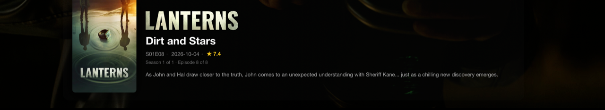
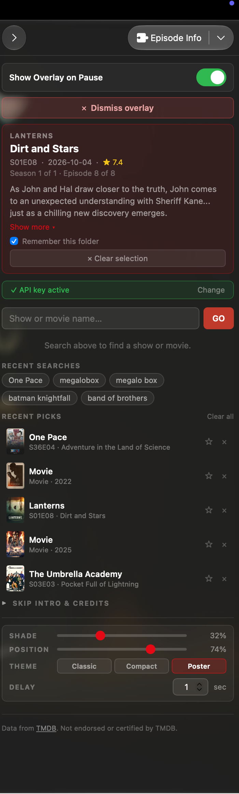
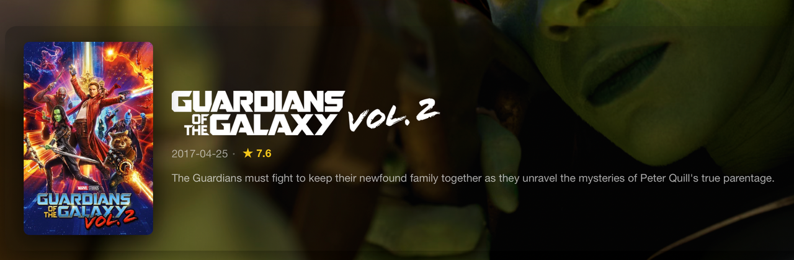
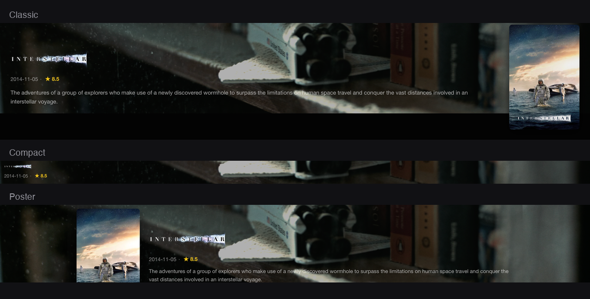

# Episode Info

**Episode and movie info from TMDB, on the video the moment you pause. Automatically.**
Optionally, one-click skipping of intros and credits.

No searching, no picking a season, no picking an episode. Open a file and the
card is already there.

All five slots are filled: card-episode.png, sidebar.png, skip-pill.png,
card-film.png and themes.png. Every image slot in this file started as an HTML
comment, so the README read correctly with none of them in place. To add
another:

  1. Put the file in docs/images/, named as below. PNG, not JPG: the card has
     large flat areas of dark grey where JPG rings.
  2. Uncomment the block and delete the surrounding <!-- and -->.
  3. Keep the alt text. It is what a screen reader gets, and it is the only
     thing left if the image 404s.

Crop tight to the thing being shown. A full window screenshot of IINA says
nothing about the plugin; a card with the video behind it says everything.
## What it does



Paused mid-episode: the card is already there, because the filename was read on
open rather than after you paused.

### Identifies the file itself

It reads the filename and works out both the title and the episode, then looks
it up. When it cannot tell, it says so and leaves you a search box, so you
click once instead of four times.

| Filename | Identified as |
|:--|:--|
| `Severance.S02E03.1080p.WEB-DL.DDP5.1.H.264-NTb.mkv` | Severance, S02E03 |
| `Breaking Bad - S03E11 - 1080p.mkv` | Breaking Bad, S03E11 |
| `Show.Name.1x05.avi` | Show Name, S01E05 |
| `Doctor Who Season 2 Episode 7.mkv` | Doctor Who, S02E07 |
| `Naruto.Shippuuden.E484.720p.Bia2Anime.mkv` | Naruto Shippuden, S01E484 |
| `AnimePahe_Nippon_Sangoku_-_05_1080p_Amazon.mp4` | Nippon Sangoku, S01E05 |
| `[SubsPlease] Frieren - 05 (1080p).mkv` | Frieren, S01E05 |
| `The.Matrix.1999.1080p.BluRay.x264-GRP.mkv` | The Matrix (1999) |
| `Footloose.1984.1080p.mkv` | Footloose, **1984**, not the 2011 remake |
| `1917.2019.1080p.BluRay.x264.mkv` | 1917 (2019) |

Release noise (`1080p`, `WEB-DL`, `DDP5.1`, `H.264`, `-NTb`, `[SubsPlease]`,
site prefixes, CRC32 checksums) is stripped before searching.

Some conventions it cannot read from the name alone:

- **A folder named after the show.** `samurai champloo/11.mkv` and
  `Show/Season 2/05.mkv` both resolve from the directory names.
- **An IMDb id.** A `tt1234567` in the name is looked up directly, in one
  request, skipping the search entirely.
- **Absolute episode numbers.** `1062` is placed by adding up the per-season
  episode counts, so long-running series land on the right season rather than
  S01E1062.

Films work too: a name with no episode code but a release year is searched as
a film, and the year is matched against TMDB so a remake never wins over the
original.

### Remembers a folder

Release groups, fansub names, site prefixes and misspelled series names are an
open set. No list of patterns covers them.

So pick a show once, manually, and the plugin remembers that the directory is
that show. Every other file in it, and in any subdirectory, skips the search
entirely. A "Remember this folder" checkbox sits under the card, and an ✕
forgets it again.

Automatic matches never write a pin. Only a pick you made yourself counts as
agreement, so one bad guess cannot quietly take over a whole folder.



Everything lives here: what the plugin worked out, the folder pin, recent
searches and picks, and the appearance controls. When it reads a filename
wrongly, the panel below the search box replaces itself with season and episode
pills to correct it.

### Shows where you are in the season

The card carries a line of context: which season and episode this is, and when
the next one airs.

```
Season 2 of 2  ·  Episode 3 of 3  ·  Next S02E04 2025-03-07
```



A film is identified by its release year rather than an episode code, and the
wordmark replaces the title entirely rather than sitting above it.

### Uses the title treatment

Where TMDB has the official wordmark, the KUNG FU PANDA or AVENGERS style title
art, the card shows it instead of the text title. For a film it stands in for
the title entirely; for an episode it sits above the episode title, which stays
as text because the logo belongs to the show.

Coverage is uneven and TMDB's logo arrays need filtering: Fight Club holds 26
entries across a dozen languages, with aspect ratios from 0.85 (a stacked
poster variant) to 8.5 (a thin wordmark). Anything squarer than 2.5:1 or
non-English is rejected, and the rest fall back to text.

It costs no extra round trip. The images sub-resource is folded into the detail
request already being made, with `append_to_response=images`.



Classic, Compact and Poster, under Overlay controls in the sidebar.

### Names what is playing

The window title, the macOS media panel and IINA's playlist read mpv's
`media-title`, so they show `Severance · In Perpetuity` instead of echoing
`Severance.S02E03.1080p.WEB-DL.DDP5.1.H.264-NTb.mkv`.

### Contacts nothing but TMDB

Two permissions: `video-overlay`, `network-request`. No analytics, no
tracking, no telemetry. `Info.json` declares exactly the hosts below and
nothing else, and CI fails the build if the code ever calls a host outside that
list, from script code or from markup.

Turn skip intro on and five further community services are contacted. See
Privacy.

## Requirements

- IINA 1.4.0 or later
- macOS 12 or later
- A free TMDB API key, from [themoviedb.org/settings/api](https://www.themoviedb.org/settings/api)

## Installation

### Local development (symlink)

IINA can load a local folder as long as it is symlinked into the plugin
directory with an `.iinaplugin-dev` suffix. IINA 1.4+ ships a CLI for this at
`IINA.app/Contents/MacOS/iina-plugin`:

```sh
ln -s /Applications/IINA.app/Contents/MacOS/iina-plugin /usr/local/bin/iina-plugin
iina-plugin link /path/to/this/repo      # create the symlink
iina-plugin unlink /path/to/this/repo    # remove it
```

Edit the files, restart IINA, done. No repacking. **This is the way to run it
while developing**, and it will not auto-update.

### Distributed (GitHub, gets auto-updates)

Push this repository to GitHub, cut a release, then in IINA:
**Preferences → Plugins → Install from GitHub...** and enter `owner/repo`.
IINA's plugin manager then handles updates. This is the only install route that
auto-updates.

### One-off from a local folder

```sh
iina-plugin pack /path/to/this/repo     # produces a .iinaplgz
```

Then double-click the `.iinaplgz`. Useful for moving the plugin to another Mac
without publishing, but it will not self-update.

## Setup

1. Open IINA → Preferences → Plugins, install the plugin.
2. Open the sidebar (⇧⌘V, or **Video → Show Video Panel**).
3. Select the **Episode Info** tab.
4. Paste your TMDB key into the orange **"TMDB API Key Required"** box and press Save.

The key is stored in the sidebar WebView's `localStorage` and is only ever sent
to `api.themoviedb.org`.

## Usage

Open a video. If the filename is recognisable the info card is already waiting.
Pause and the overlay appears after the configured delay.

If you paused while the lookup was still running, the card appears as soon as
it lands. You do not need to pause again.

Search still works the same way if you want to override what was detected, and
**Recent Picks** re-applies an identification to whatever is playing now.

## Settings

Under the overlay controls: shade opacity, vertical position, one of three
themes (classic, compact, poster), and the delay before the card appears on
pause.

## Skip intro (optional, experimental)

Turn on **Skip Intro & Credits** in the sidebar. A button appears when playback
reaches an intro, recap or credits; click it or press ⌥S. It never seeks on its
own.

This is **not** served by TMDB. Timings come from the file's own chapter
markers where present, otherwise from four community databases: IntroDB, TheIntroDB,
SkipDB and ARM→AniSkip for anime. They are queried together, preferring sources
that agree. Coverage is good for popular shows and thin for new or niche ones.

**Search again** asks the databases for a fresh answer, even for a file whose
chapters already answered it. If the databases have nothing, the chapters stand:
you cannot lose a working pill by pressing it.


The pill only appears inside a segment, and only while the video is playing. It
never seeks on its own.

## Privacy

This plugin contacts:

- `api.themoviedb.org` / `image.tmdb.org` for episode info and posters, always
- `api.introdb.app` / `api.theintrodb.org` / `api.skipdb.tv` for intro timings,
  only if skip intro is on
- `arm.haglund.dev` / `api.aniskip.com` for anime intro timings, only if skip
  intro is on

No analytics, no tracking, no telemetry. `Info.json` declares exactly these
hosts and nothing else, and CI fails the build if the code ever calls a host
outside that list. Comments are stripped first, so naming a host in prose does
not count as calling it. Covered: URLs in scripts, in `src`, `action`,
`srcset`, `data`, `poster` and `link href`, plus CSS `@import` and
`url()`. Not covered: a URL written into an inline event handler or a
`formaction`, a protocol-relative `//host`, and a host assembled at runtime
from pieces. An `<a href>` is excluded on purpose: that is a link the user
clicks, not a request the plugin makes.

## Development

```sh
npm test                    # the parser and identification suite
node scripts/check-apis.mjs # verify every upstream API still behaves
```

Both use only Node's standard library. There is no build step and no runtime
dependency.

The test suite extracts the `<script>` bodies out of the two web views and runs
them against a mocked `fetch`, `document`, `localStorage` and `iina`, so the
filename parser and the whole identification path are covered without clicking
anything. It is the reason a release group called "One Pace" still finds One
Piece, and the reason `IMG_1234.MOV` is left alone instead of being read as
episode 1234 of a show called IMG.

`check-apis.mjs` runs daily in CI, probing each endpoint and opening (then
auto-closing) an issue if one breaks. Add `TMDB_API_KEY` to `.env` to verify
response shapes as well; without it the endpoints are still proven alive and
enforcing auth.

## Attribution

This product uses the TMDB API but is not endorsed or certified by TMDB.

Title treatments, posters and episode data come from
[themoviedb.org](https://www.themoviedb.org). Images are served from
`image.tmdb.org` under TMDB's terms. TMDB requires this notice wherever their
data is displayed, so a short form appears at the foot of the sidebar panel and
the full wording is reproduced here.

Skip-intro timings come from IntroDB, TheIntroDB, SkipDB and
[AniSkip](https://aniskip.com), which are independent community services with
no affiliation to this plugin or to TMDB.

Inspiration for the filename-parsing approach, and the reason the season and
episode arithmetic in `locateAbsolute` is written the way it is, came from
Zain Imam's work on the same problem.

## Licence

MIT, see [LICENSE](LICENSE).